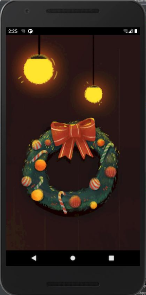
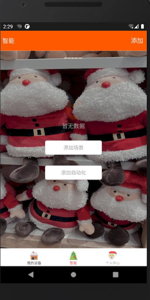
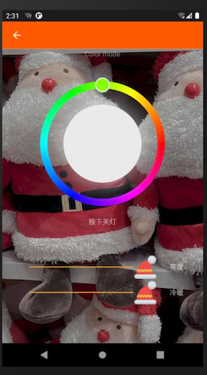
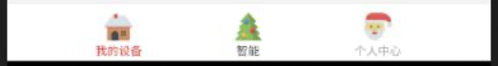
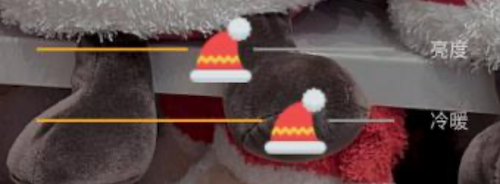
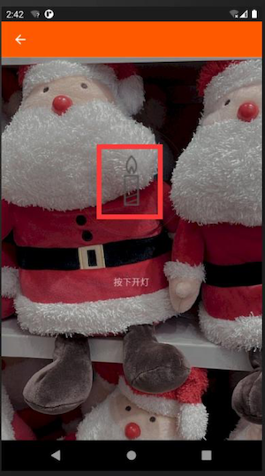
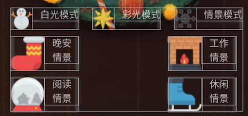

# Tuya Smart Light Demo App

This project wins the Tuya App SDK Camp Competition in Dec, 2020 by 刘畅. It's developed using [Tuya Android Home App SDK](https://github.com/tuya/tuya-home-android-sdk), which enables you to quickly develop branded apps connecting and controlling smart scenarios of many devices.

For more information, please check [Tuya Developer Website](https://developer.tuya.com/en/docs/iot/app-development/sdk-development/app-sdk-instruction?id=K9kjstc7t376p)..

### 涂鸦智能 APP 圣诞特别版

本项目基于 [Tuya Android Home App SDK](https://github.com/tuya/tuya-home-android-sdk)，通过修改内部布局文件和素材等内容， 实现了涂鸦智能 APP 圣诞版配色;同时新增了模式面板，可以修改灯的模式与情景。

### 布局素材设计
#### 一. 主要背景设计

#### 1. 启动界面设计

通过更改 ty_pre.png 文件，修改整个启动界面，素材的主要元素有灯和圣诞花
环，暗示整个 APP 主要为控制灯而生，与整个 APP 功能相协调。

#### 2. 主界面设计

通过将 xml 文件的背景进行替换，将整个背景采用圣诞元素壁纸。

#### 3. 设备界面设计

同主界面背景一样，采用了同一背景设计，将整体突兀程度降低。

#### 二. 元素设计

#### 1. 任务栏元素设计

任务栏图标进行了重新设计，图标主要来源是[iconfont](https://www.iconfont.cn/?spm=a313x.7781069.1998910419.d4d0a486a) 图标库，进行相关转换后
插入到默认位置。 同时因为技术限制，无法将旧有的图标删除，所以我将他们的颜色改为了
``#000000``，即可不显示。

#### 2. 滑动栏元素设计

通过修改相关 xml 文件，将整个滑动的原点替换为了圣诞帽，体现了圣诞节限定的
特点。

#### 3. 关灯元素设计

将关灯后的“灯”元素改变为“蜡烛元素”。

#### 4. 模式面板元素设计

模式面板如图，也使用了圣诞相关配色。

### 反思总结

首先，非常感谢涂鸦智能提供的本次 APP SDK 训练营活动。我们看到，由于安 卓 APP 开发系统的开放性，移动端迅速发展，企业开发从传统的 PC 端开发移动 app。 涂鸦智能提供的 demo 工程提供了智能家居相关的开发工具包和 UI 业务包,大大便于 开发者和相关企业快速开发出定制的智能家居 App。
作为一名开发者，我深切感受到了涂鸦智能的巨大潜力，这种提供基础的 APP SDK 开发方式为智能家具行业提供了最优的解决方案，同时将广大开发者从繁杂的 劳动中解放出来，能够有更多的时间去专注于业务的开发。
最后，仍然感谢涂鸦智能举办的这次训练营活动，同时也感谢默默在背后付出的 相关运营小姐姐和小哥哥以及及时解决我们开发问题的攻城狮们，通过本次活动让
我掌握了一些 APP 开发的技巧和能力，祝涂鸦越办越好。

